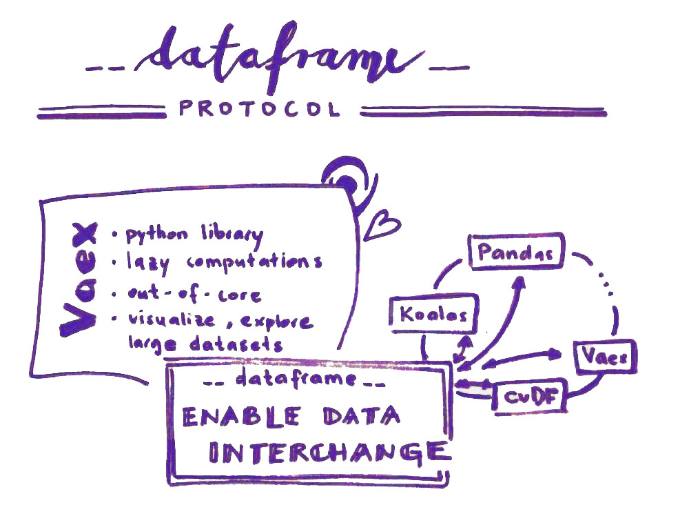

# Vaex dataframe interchange protocol implementation
I created this personal repo to save and share my work on the dataframe interchange protocol for Vaex library.

## Nootebooks

With Jupyter Notebooks I am doing my research. To try them out use mybinder and select notebook_research folder.

## Issues
With opening and closing of the issues I keep track of work that was and needs to be done.

# Final blog post and Example Notebook

You can see the final Blog post on the Quansight web page here: (in progress)

To try out an example notebook with a live Python kernel, use mybinder:

