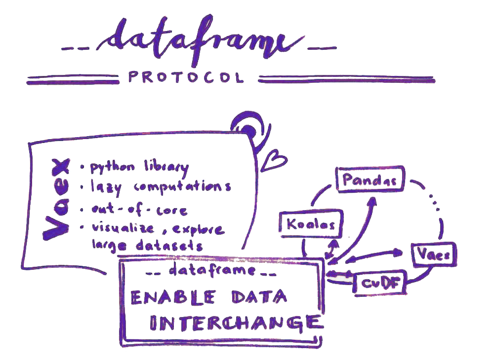

# Journey through the internship
*First draft 10/09/2021*

In July 2021 I started my journey as a Quansight Labs Intern. In this blog I am going to reflect on my experience with the on-boarding process, how the interaction in the Labs has been and hopefuly interesting detils of the project I have been working on.

## On-boarding
Starting with a new project in a new environment is an exciting but also a stressful change. To make it more interesting, the work at Quansight is fully remote. For me personaly that means more space to figure things out. I don't have trouble getting things done. If, with this freedom to work, you can also receive the right amount of interaction, motivation, community vibe, ... that is just awesome. And that was how I experienced my internship from an organizational perspective.

Before starting I met with my mentor, [Kshiteej Kalabarkar](https://github.com/kshitij12345), to have a feeling of what was expected, how will my first week look like and what is the project I will be working on.

On-boarding process was very friendly with a perfect rithm. Most of the information about the process passed thorough the email, Labs Internship Handbook written in Notion was circulated containing all possible info you need. We received a warm welcome via Slack and from day one on we had a weekly Intern Share where all the interns and organizers got together. In the first place to introduce each other, later to presented, hear about and support the work in progress. They were interesting from knowladge as well as social perspective.

## Project description

The project I was working on at Quansight Labs was the **implementation of the dataframe api protocol into the Vaex library**.

### What is all that?

>The purpose of the **Dataframe interchange protocol (`__dataframe__`)** is to enable data interchange. I.e., a way to convert one type of dataframe into another type (for example, convert a Koalas dataframe into a Pandas dataframe, or a cuDF dataframe into a Vaex dataframe).

With the protocol implemented in dataframe libraries we will be able to write code that exepts any kind of dataframe 🎉  
For more information visit the [RFC blog post](https://data-apis.org/blog/dataframe_protocol_rfc/) or the [official site](https://data-apis.org/dataframe-protocol/latest/index.html).

>**Vaex library** is a high performance Python library for lazy Out-of-Core DataFrames, to visualize and explore big tabular datasets.

More about the Vaex library is available on the [official site](https://vaex.io/docs/index.html) and [blog](https://vaex.io/blog).

My work thereby included connecting `vaex` dataframe class to a base class `__dataframe__` specified by the Consortium for Python Data API Standards.

### How did I start?

After reading and re-reading the specifications I tried to talk about the problem as much as possible. With my mentor, with my colleague, with a friend, etc. Talking about it helped me get a bigger picture and an idea of where to start. Starting is hard. Talking about it helps ☕️💗 

A [prototype implementation](https://github.com/data-apis/dataframe-api/blob/27b8e1cb676bf10704d1dfc3dca0d0d806e2e802/protocol/pandas_implementation.py) for `Pandas` dataframe has already been written so I started there with the most simple part, understanding the method for `int` and `float` type of Vaex dataframe. I had to check out the library and get to know it better.

The general method in the dataframe protocol where the transformation between dataframes happens is called `from_dataframe`. It iterates through the dictionary of columns from the input dataframe, calls the correct methods and transfers the column to the desired type.

The base class for the `__dataframe__` method includes three sepearate classes which are `_Buffer`, `_Column` and `_DataFrame`. Each of them has necessary and additional methods to construct and describe a dataframe. 

## Interesting topics covered, interesting lessions learned
- **Vaex Library**: first of all I learned a lot about the Vaex library. With it's lazy calculations and expressions it is really an interesting project to be working on.

-  **Data frame**:
as an R user the concept of a dataframe is not new to me. But in Python every library has it's own way of defining it. For the purpose of this protocol the term is defined as follows:

> A dataframe is an ordered collection of columns, which are conceptually 1-D arrays with a dtype and missing data support. A column has a name, which is a unique string. A dataframe or a column may be “chunked”, meaning its data is not contiguous in memory.

- **Data Types**:
when working with data you came across the topic of data types for sure. While working on this project I had to think of it all the time, taking care that it remains correct with the transfer. It was the first time after university that I have researched bits and bytes, format strings and indianess. It was the first time I researched the topic of **buffers** and the rationale behing storing data.

    To find out more about data types visit https://github.com/data-apis/dataframe-api/issues/26.

- **Array interface**: 
when the `from_dataframe` method iterates through the columns it basically transfers the problem to columnar level and there the interchange of data is really happening. That means array API is used. The easiest way is with [DLPack](https://github.com/dmlc/dlpack). Pandas and Vaex don't have this protocol implemented so insted we have to refer to the buffer and exchange data through the [`array_interface`](https://numpy.org/devdocs/reference/arrays.interface.html). That means that in Pandas and Vaex implementation columns are read as NumPy arrays (ndarrays) and with that `array_interface` is used.

- **Categoricals**:
categorical columns turned out to be very complicated. Every library has it's own way of handling this kind of data and it is necessary to spend some time learning about it. In Vaex the API will be changed to match Arrow in the future (reference: https://github.com/data-apis/dataframe-api/issues/41).

- **Building the library localy**:
for the whole first month I was playing around in Jupyter Lab. After the code got more structured I needed to implement it localy and it was tricky at first. I had no idea where to start. I had trouble running the tests. Doing lots of silly things :smirk:

	At the end it turned out not to be that difficult. You need to spend some time researching how the librarly is organized and you also need to be sure your local library is in fact editable. I had to learn the importance of building the library locally in a correct way :lough:

- **Connecting with the developers**:
right after implementing the protocol localy I got connected with Vaex developers. They were extremly friendly, understanding and helpful. I submited a draft PR and with [Maarten Breddels](https://vaex.io/profile/maarten) help my project got pushed further on and some errors and missunderstandings were corrected.

- **Personal repository for ongoing work**:
what I found very helpful after submiting the draft PR was making a personal repository where I saved my ongoing work and made issues to track my work. In this way I was able to organize better and the stress of not knowing what exactly should be done next or how fast I should be working was reduced. Also the sharing of work with colleagues and mentor was easier.

- **Missing values**:
after implementing the protocol for all dtypes another complicated topic was left and that was missing values. Just clarifying what a missing value should and should not be proved to be difficult and there isn't one way of looking at it. True missing and NaN is a different thing altogether but when coming to analysing you deal with unavailable data in both cases. The other thing is how to store missing values? Nullable, sentinel, with bit or byte mask,...?

	More about this topic can be found here: https://github.com/data-apis/dataframe-api/issues/9.

	While researching I got lost. Vaex is built on top of NumPy and Apache Arrow so my first task was to understand NumPy and Arrow seperately. Specifying missing values differed between the two. In NumPy one can use masked array subclass of the ndarray, known as ‘numpy.ma’ ([source]() or a missing data placeholder “NA (not available)” which can change the dtype of the data. In Apache Arrow bitmask is used for all dtypes.
	
	After losing lots of time I realised there is a better solution, and mush easier, as all the details are solved in Vaex itself. All the missing values in Vaex are masked so I used a bitmask from `.ismissing()` method and worked with that. 

- **Virtual columns**:
[virtual columns](https://vaex.io/docs/tutorial.html#Virtual-columns) are another great thing in Vaex. As it lazily evaluates the data a newly defined column/expression will not be saved to memory unless specified. 

- **Chunks**:
the last thing I had to take care of was the implementation of the protocol for chunked dataframe. A chunk is a subset of a column or dataframe that contains a set of (neighboring) rows. Nice visual can be seen [here](https://data-apis.org/dataframe-protocol/latest/design_requirements.html).

	Vaex can read data in chunks. It is not the only library that does so and it is a functionality that should be preserved if possible. What I hadd to add to make it work was the definition of chunks in the `__dataframe__` classes and an iteration through the chunks in `from_dataframe()` before iterating through the columns.

## The End
These were the main things that needed to be done and from which I have learned a lot. I still had more than 3 weeks after submiting my first ready-for-review PR to Vaex library. While waiting for the comments I had enough time to make this blog post and an example Notebook (link!).

At the end the experiance as an Quansight Intern was highly positive and I am planning to stay engaged in the work of the dataframe API protocol even when the contract is over.
