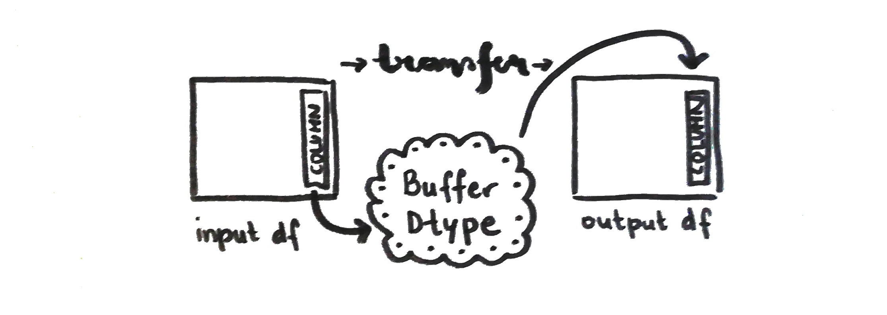
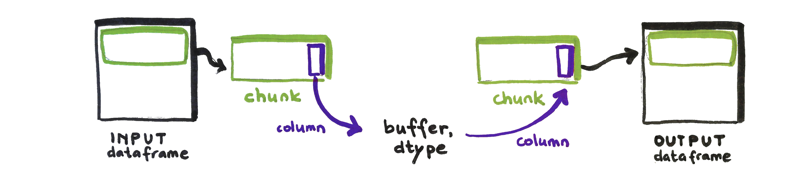

# Journey through the internship

In July 2021 I started my journey as a Quansight Labs Intern. In this blog I am going to reflect on my experience with the on-boarding process, how the interaction in the Labs has been and hopefully interesting details of the project I have been working on.

## On-boarding
Starting with a new project in a new environment is an exciting but also a stressful change. To make it more interesting, the work at Quansight is fully remote. For me personally that means more space to figure things out. I don't have trouble getting things done. If, with this freedom to work, you can also receive the right amount of interaction, motivation, community vibe, ... that is just awesome. And that was how I experienced my internship from an organizational perspective.

Before starting I met with my mentor, [Kshiteej Kalabarkar](https://github.com/kshitij12345), to get a feeling of what was expected, how will my first week look like and what is the project I will be working on.

On-boarding process was very friendly with a perfect rhythm. Most of the information about the process passed thorough the email, Labs Internship Handbook was circulated containing all possible info you might need. We received a warm welcome via Slack and from day one on we had a weekly Intern Share where all the interns and mentors got together. At first to introduce each other, later to present, hear about and support the work in progress. Presentations were interesting from knowledge as well as social perspective.

## Project description

The project I was working on at Quansight Labs was the **implementation of the dataframe api protocol into the Vaex library**.

### What is all that?

>The purpose of the **Dataframe interchange protocol (`__dataframe__`)** is to enable data interchange. I.e., a way to convert one type of dataframe into another type (for example, convert a Koalas dataframe into a Pandas dataframe, or a cuDF dataframe into a Vaex dataframe).

With the protocol implemented in dataframe libraries we will be able to write code that accepts any kind of dataframe 🎉  
For more information visit the [RFC blog post](https://data-apis.org/blog/dataframe_protocol_rfc/) or the [official site](https://data-apis.org/dataframe-protocol/latest/index.html).

>**Vaex library** is a high performance Python library for lazy Out-of-Core DataFrames, to visualize and explore big tabular datasets.

More about the Vaex library is available on the [official site](https://vaex.io/docs/index.html) and [blog](https://vaex.io/blog).

My work thereby was to connect Vaex `dataframe` class to a `__dataframe__` class called `VaexDataFrame` specified by the Consortium for Python Data API Standards.

### How did I start?

After reading and re-reading the specifications I tried to talk about the problem as much as possible. With my mentor, with my colleague, with a friend, etc. Talking about it helped me get a bigger picture and an idea of where to start. Starting is hard. Talking about it helps ☕️💗 

A [prototype implementation](https://github.com/data-apis/dataframe-api/blob/27b8e1cb676bf10704d1dfc3dca0d0d806e2e802/protocol/pandas_implementation.py) for `Pandas` dataframe has already been written so I started there with the most simple part, understanding the method for `int` and `float` type of Vaex dataframe. I had to check out the library and get to know it better.

The general method in the dataframe protocol where the transformation between dataframes happens is called `from_dataframe`. It iterates through the dictionary of columns from the input dataframe, calls the correct methods and transforms the column to the desired type.
p
The base class for the `__dataframe__` method includes three separate classes which are `_Buffer`, `_Column` and `_DataFrame`. In Vaex implementation we named them `_VaexBuffer`, `_VaexColumn` and `_VaexDataFrame` respectively. Each of them has necessary and utility functions to construct and describe a dataframe. 

## Interesting topics covered, interesting lessons learned
- **Vaex Library**: first of all I learned a lot about the Vaex library. With it's lazy calculations and expressions it is really an interesting project to be working on.

-  **Data frame**:
as an R user the concept of a dataframe is not new to me. But in Python every library has it's own way of defining it. For the purpose of this protocol the term is defined as follows:

	> A dataframe is an ordered collection of columns, which are conceptually 1-D arrays with a dtype and missing data support. A column has a name, which is a unique string. A dataframe or a column may be “chunked”, meaning its data is not contiguous in memory.

- **Data Types**:
when working with data you came across the topic of data types for sure. While working on this project I had to think of it all the time, taking care that types remain correct with the transfer. It was the first time after university that I have researched bits and bytes, format strings and endianness. It was the first time I researched the topic of **buffers** and the rationale behind storing data in it.

    To find out more about data types visit https://github.com/data-apis/dataframe-api/issues/26.

- **Array interface**: 
when the `from_dataframe` method iterates through the columns it basically transfers the problem to columnar level and where the interchange of data is really happening. That means array API is used. The easiest way is with [DLPack](https://github.com/dmlc/dlpack). Pandas and Vaex don't have this protocol implemented so instead we have to refer to the buffer and exchange data through the [`array_interface`](https://numpy.org/devdocs/reference/arrays.interface.html). That means that in Pandas and Vaex implementation columns are read as NumPy arrays (ndarrays) via `array_interface`.

- **Categoricals**:
categorical columns turned out to be very complicated. Every library has it's own way of handling this kind of data and it is necessary to spend some time learning about it. In Vaex the API will be changed to match Arrow in the future (reference: https://github.com/data-apis/dataframe-api/issues/41).

    Based on my research you can have Vaex categorical columns made with methods `categorize` or `ordinal_encode` (which is deprecated). There is another possibility where the underlying expression is an Arrow dictionary. Both possibilities have different ways of working with categoricals. This means there had to be checks added to see what kind of expression is used  (Vaex categorical or Arrow dictionary).
    
    Also the idea in the protocol is that only the codes of the categories are transformed through the buffer. Categories are mapped and than applied to the codes afterwords. In the first case of Vaex categoricals there is a special case where codes needed to be calculated separately.

- **Building the library locally**:
for the whole first month I was playing around in Jupyter Lab. After the code got somewhat structured I needed to implement it locally and it was tricky at first. I had no idea where to start. I had trouble running the tests. All in all doing lots of silly things 😏

	At the end it turned out not to be that difficult. I had to spend some time researching how the library is organized and realized I should be sure that my local library is in fact editable. I had to learn the importance of building the library locally in a correct way 😁

- **Connecting with the developers**:
right after implementing the protocol locally I got connected with Vaex developers. They were very friendly, understanding and helpful. I submitted a draft PR and with [Maarten Breddel's](https://vaex.io/profile/maarten) help my project got pushed further on and some errors and misunderstandings were corrected.

- **Personal repository for ongoing work**:
what I found very helpful after submitting the draft PR was making a personal repository where I saved my ongoing work and made issues to track the working process. In this way I was able to organize better and the stress of not knowing what exactly should be done next or how fast I should be working was reduced. Also the sharing of work with colleagues and mentor was easier.

- **Missing values**:
after implementing the protocol for all dtypes another complicated topic was left and that was missing values. Just clarifying what a missing value should and should not be proved to be difficult and there isn't one way of looking at it. True missing and NaN is a different thing altogether but when coming to analysing you deal with unavailable data in both cases. The other thing is how to store missing values? Nullable, sentinel, with bit or byte mask,...?

	More about this topic can be found here: https://github.com/data-apis/dataframe-api/issues/9.

	While researching I got lost. Vaex is built on top of NumPy and Apache Arrow so my first task was to understand NumPy and Arrow separately. Specifying missing values differed between the two. In NumPy one can use masked array subclass of the ndarray, known as `numpy.ma` or a missing data placeholder `NA (not available)` which can change the dtype of the data. In Apache Arrow bitmask is used for all dtypes.
	
	After spending lots of time I realized there is a better solution, and much easier one, as all the details are solved in Vaex itself. All the missing values in Vaex are masked so I used a bitmask from `.ismissing()` method and worked with that. There are some attribute methods I needed to specify in the `__dataframe__` classes like number of missing values and how are the missing values described. The other thing that I needed to specify is how Vaex handles missing data so that the library transforming from Vaex dataframe will know what to do with the missing values. The last thing that needed to be done is to apply this logic for transformation to  Vaex dataframe that means I needed to specify how the missing values are applied after getting the data out from the buffer. I decided to go for the Apache Arrow arrays and setting the missing data as a mask attribute.

- **Virtual columns**:
[virtual columns](https://vaex.io/docs/tutorial.html#Virtual-columns) are another great thing in Vaex. As it lazily evaluates the data a newly defined column/expression will not be saved to memory unless specified. As far as the implementation is concerned the code already materializes them and handles them as normal columns. So there was no additional work needed in this case.

- **Chunks**:

	> A chunk is a subset of a column or dataframe that contains a set of (neighboring) rows. Nice visual can be seen [here](https://data-apis.org/dataframe-protocol/latest/design_requirements.html).
    
    

    
    Vaex can read data in chunks. It is not the only library that does so and it is a functionality that should be preserved if possible. What I had to add to make it work was the definition of chunks in the `__dataframe__` classes and an iteration through the chunks in `from_dataframe()` before iterating through the columns.

- **Strings**:
The last thing that was implemented as the part of the internship was the handling of variable-length string dtypes. Pandas implementation already had a great [PR merged](https://github.com/data-apis/dataframe-api/pull/47) and it turned out it could easily be applied to Vaex case as well.

In the `get_buffers` method the data needs to be encoded to pass it through the buffer. Also the offset of each string is saved to the offset buffer in order to be able to decode the strings when transforming from buffers in `from_dataframe`.

## Example notebook

These were the main things that needed to be done and from which I have learned a lot. If you would like to play around with the data I made an Example Notebook that is posted on my github profile and you can try it out with a live Python kernel:

At the end the experience as an Quansight Intern was highly positive and I am planning to stay engaged in the work of the dataframe API protocol even when the internship is over.

