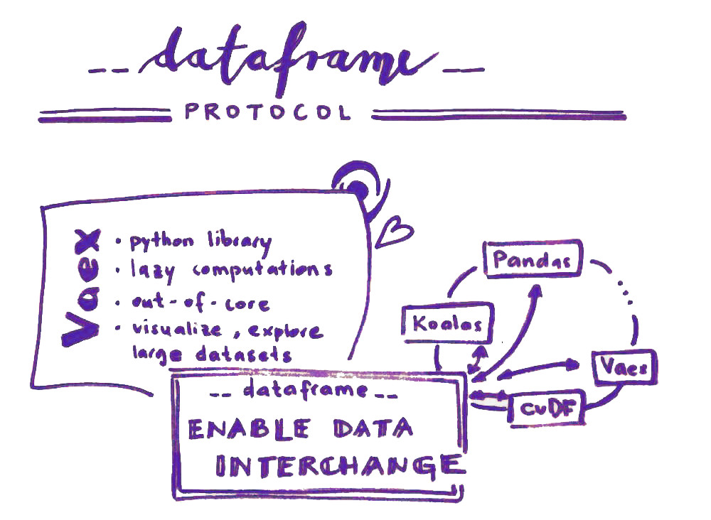
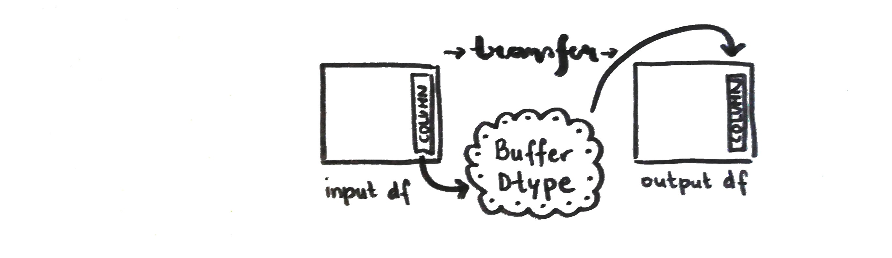
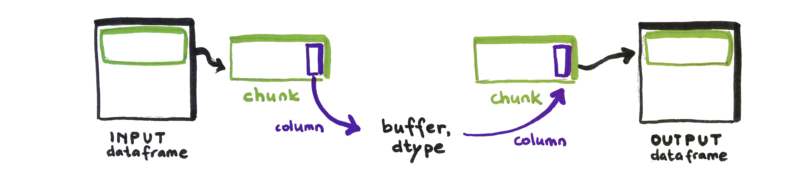

# Dataframe protocol and Vaex library

The work I briefly describe in this blog post is the **implementation of the dataframe api protocol into the Vaex library** which I was working on through the three month period as a Quansight Labs Intern.

## About

### Dataframe protocol

>The purpose of the **Dataframe interchange protocol (`__dataframe__`)** is to enable data interchange. I.e., a way to convert one type of dataframe into another type (for example, convert a Koalas dataframe into a Pandas dataframe, or a cuDF dataframe into a Vaex dataframe).

With the protocol implemented in dataframe libraries we will be able to write code that accepts any kind of dataframe 🎉  
For more information visit the [RFC blog post](https://data-apis.org/blog/dataframe_protocol_rfc/) or the [official site](https://data-apis.org/dataframe-protocol/latest/index.html).

### Vaex library

>**Vaex library** is a high performance Python library for lazy Out-of-Core DataFrames, to visualize and explore big tabular datasets. It can calculate statistics such as mean, sum, count, standard deviation etc, on an N-dimensional grid up to a billion objects/rows per second. Visualization is done using histograms, density plots and 3d volume rendering, allowing interactive exploration of big data. Vaex uses memory mapping, a zero memory copy policy, and lazy computations for best performance (no memory wasted).

More about the Vaex library is available on the [official site](https://vaex.io/docs/index.html) and [blog](https://vaex.io/blog).

## Implementation

### Data frame
For the purpose of the dataframe protocol the term is defined as follows:

> A dataframe is an ordered collection of columns, which are conceptually 1-D arrays with a dtype and missing data support. A column has a name, which is a unique string. A dataframe or a column may be “chunked”, meaning its data is not contiguous in memory.

**Implementation of the dataframe protocol** connects Vaex `dataframe` class to a `__dataframe__` class called `VaexDataFrame` specified by the Consortium for Python Data API Standards.

### Simple int and float dtypes first

A [prototype implementation](https://github.com/data-apis/dataframe-api/blob/27b8e1cb676bf10704d1dfc3dca0d0d806e2e802/protocol/pandas_implementation.py) for pandas dataframe has already been written so I started there with the most simple part: understanding and implementing the method for `int` and `float` type of Vaex dataframe. 

The general method in the dataframe protocol where the transformation between dataframes happens is called `from_dataframe`. It iterates through the dictionary of columns from the input dataframe, calls the correct methods and transforms the column to the desired type.

The base class for the `__dataframe__` method includes three separate classes which are `_Buffer`, `_Column` and `_DataFrame`. In Vaex implementation we named them `_VaexBuffer`, `_VaexColumn` and `_VaexDataFrame` respectively. Each of them has necessary and utility methods to construct and describe a dataframe. 

### Array interface

When the `from_dataframe` method iterates through the columns it basically transfers the problem to columnar level where the interchange of data is really happening. That means array API is used. The easiest way is with [DLPack](https://github.com/dmlc/dlpack). Pandas and Vaex don't have this protocol implemented so instead we have to refer to the buffer and exchange data through the [`array_interface`](https://numpy.org/devdocs/reference/arrays.interface.html). Therefore in Pandas and Vaex implementation the columns are read as NumPy arrays (ndarrays) via `array_interface`.

### Buffer and dtype

The specifications of the buffer, for example, buffer size, a pointer to the start of the buffer, DLPack attributes and a string representation of the buffer, are a part of the `_VaexBuffer` class.

In the `_VaexColumn` class the data type description is added in `.dtype` as a tuple ``(kind, bit-width, format string, endianness)``. It is used as a descriptive attribute and also as an input to construct a NumPy array from the buffer. The implementation of the dtype got more complicated when dealing with categoricals and string dtypes.

To find out more about data types support visit https://github.com/data-apis/dataframe-api/issues/26.

The function from the `_VaexColumn` class that saves the data into a `_VaexBuffer` class to be transformed in the process is `get_buffers`. It returns a dictionary of three separate two-element tuples:

- `_get_data_buffer`: buffer containing the data and it's associated dtype,
- `_get_validity_buffer`: buffer containing mask values indicating missing data and it's associated dtype,
- `_get_offsets_buffer`: offset values for variable-size binary data (e.g., variable-length strings) and it's associated dtype.

These specifications are used in the `from_dataframe` method when columns are iterated through. The method calls the `get_buffer` function and transforms the data via `array_interface`. If, for example, the user wants to transform Pandas dataframe to a Vaex instance, the Vaex `from_dataframe` method (that we called `from_dataframe_to_vaex` just to make it clearer) calls Pandas `get_buffer` method and then makes the transformation. 

### Categoricals
   
The idea in the protocol is that only the codes of the categories are transformed through the buffer. Categories are mapped and than applied to the codes afterwords. The function from `_VaexColumn` class used to determine the mapping is `describe_categorical`. It returns a dictionary with first boolean value indicating whether the ordering of dictionary indices is semantically meaningful, second boolean value indicating whether a dictionary-style mapping of categorical values to other objects exists and third the mapping of the categories.

Based on my research you can have Vaex categorical columns made with methods `categorize` or `ordinal_encode` (which is deprecated). There is another possibility where the underlying expression is an Arrow dictionary. Both options have different functions to be used.

Additionally there is a special case in Veax when `categorize` function is used and codes need to be calculated separately (year column in the example: https://vaex.io/docs/_modules/vaex/dataframe.html#DataFrameLocal.categorize)

### Missing values

Clarifying what a missing value should and should not be is quite difficult and there isn't one way of looking at it. True missing and NaN is a different thing altogether but when coming to analysing you deal with unavailable data in both cases. The other question is how to store missing values? Nullable, sentinel, with bit or byte mask,...?

More about this topic can be found here: https://github.com/data-apis/dataframe-api/issues/9.

Methods in the `_VaexColumn` class used for the missing data are the number of missing values `null_count` and `describe_null` which returns the missing value (or "null") representation the column dtype uses, as a tuple ``(kind, value)``. "Kind" can be non-nullable, NaN/NaT, sentinel value, bit mask or byte mask. The "value" can be the actual (sentinel) value, (0 or 1) indicating a missing value in case of a mask representation or None otherwise.

All the missing values in Vaex are nullable. Arrow columns via bitmask, NumPy columns via bool/byte arrays. For the specification I used an boolean array output from Vaex `.ismissing()` method and worked with that.

The method `from_dataframe` needs to check for the null representation and apply the missing values accordingly. In the implementation for Vaex library the validity buffer is taken as a mask input for the Arrow array with which the transformed data is constructed into an array/column. In case of sentinel values the value from `describe_null` is used to construct a mask and use it in the Arrow array also.

### Virtual columns

[Virtual columns](https://vaex.io/docs/tutorial.html#Virtual-columns) are materialized and the protocol handles them as normal columns. 

### Chunks

> A chunk is a subset of a column or dataframe that contains a set of (neighboring) rows.

Nice visual can be seen [here](https://data-apis.org/dataframe-protocol/latest/design_requirements.html).

The `_VaexColumn` and `_VaexDataFrame` methods used in the case of chunked dataframe are `num_chunks` and `get_chunks`. With former the `from_dataframe` method checks if the dataframe is chunked or not and iterates through the chunks if necessary. The iterator is the output of the `get_chunks` method from the `_VaexDataFrame` class.

Vaex can read data in chunks. It is not the only library that does so and it is a functionality that should be preserved if possible.

### String dtype

The last thing that was implemented as the part of the internship was the handling of variable-length string dtypes. Pandas implementation already had a great [PR merged](https://github.com/data-apis/dataframe-api/pull/47) and it turned out it could easily be applied to Vaex as well.

In the `get_buffers` method the data needs to be encoded to pass it through the buffer. Also the offset of each string is saved to the offset buffer in order to be able to decode the strings when transforming from buffers in `from_dataframe`.

## Example Notebook

If the topic is of interest to you there is an Example Notebook you can try out with a live Python kernel.

Thank you for reading through.

